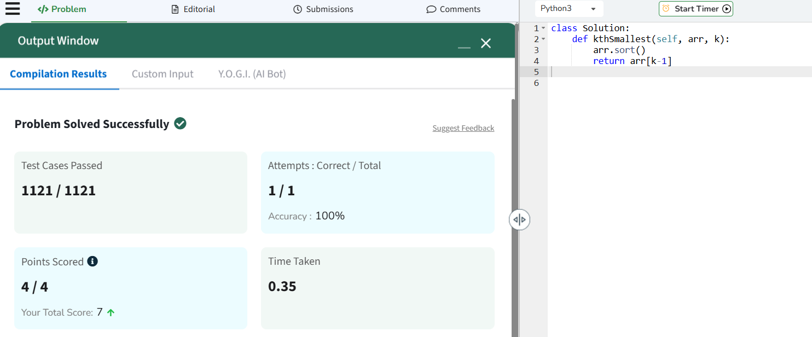

# Experiment 03 – Find Kth Smallest Element in an Array

## Problem Statement
Write a program to find and return the **kth smallest element** in the given array.

**Input:**  
Array: [10, 5, 4, 3, 48, 6, 2, 33, 53, 10]  
k = 4

**Output:**  
The 4th smallest element is 5

## Algorithm
1. Take the input array and the value of k  
2. Sort the array in ascending order  
3. Access the element at index `k-1`  
4. Print the kth smallest element

## Python Code
The code for this experiment is in `kth_smallest_array.py`

## Output Screenshot

